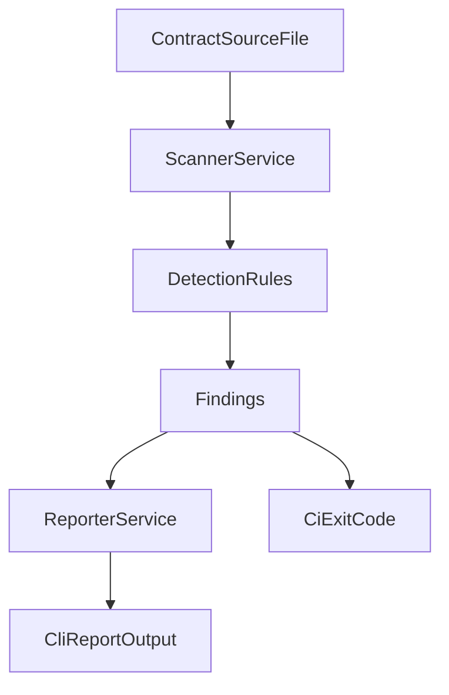

# OverflowSentinel Architecture (PoC)

## Objective
Detect boundary-check bugs around shift-based overflow guards before deployment.

## Design
OverflowSentinel is an off-chain CLI static analyzer with three layers:

1. **Input Layer**
   - Accepts a source file path (`.move`, `.sol`, or text-like contract code).
   - Reads source as plain text for fast analysis.

2. **Detection Layer**
   - Applies exploit-informed rules:
     - `OS-001`: suspicious all-ones high-bit mask checks.
     - `OS-002`: strict comparator at boundary where inclusive check is expected.
     - `OS-003`: left-shift operations without obvious checked helper context.
   - Returns finding objects with line context.

3. **Reporting Layer**
   - Outputs finding severity, line references, explanation, and suggested fix.
   - Exits with non-zero code when high severity issues exist, enabling CI gating.

## Data Flow

## Why Off-Chain (Not On-Chain)
- Smart contracts cannot practically audit arbitrary source code.
- On-chain scanning is expensive and operationally unrealistic.
- Security analysis belongs in developer CI/CD pipelines before deployment.

## MVP Scope and Limits
- **Strength:** very clear signal for Cetus-style math guard mistakes.
- **Limitation:** text-level heuristics may need AST upgrades for production-grade precision.
- **Next step:** add parser-backed data flow and protocol-specific rule packs.
